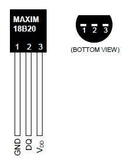
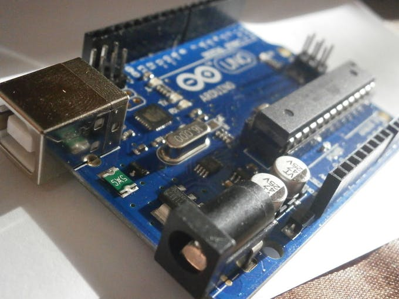
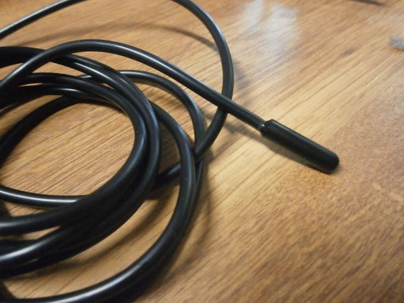
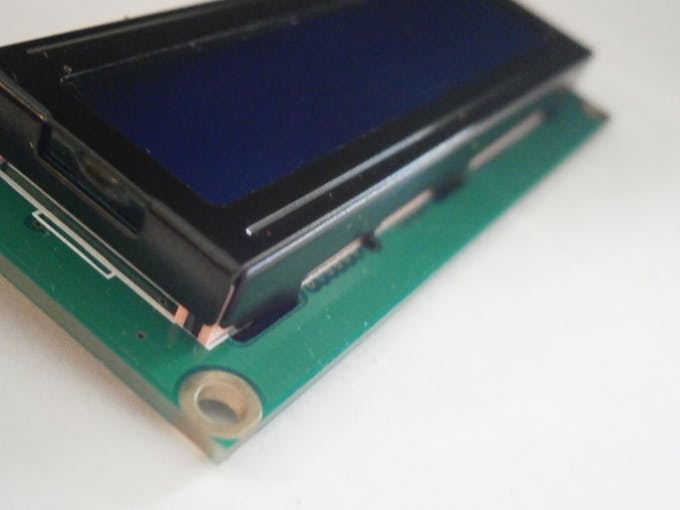
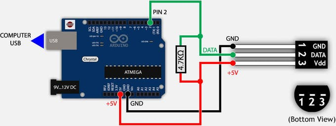

# DS18B20 (Digital Temperature Sensor) and Arduino © GPL3+

By Konstantin Dimitrov

Published on :  November 22, 2016.

Retrieved from:  https://create.arduino.cc/projecthub/TheGadgetBoy/ds18b20-digital-temperature-sensor-and-arduino-9cc806

In this protip, I will show you how to build DS18B20 Digital Thermometer with Arduino.

## Components and Supplies

- A000066 Arduino UNO (or Genuino UNO)

- Maxim Integrated DS18B20 Programmable Resolution 1-Wire Digital Thermometer

- Resistor 4.75k ohm	

- Breadboard (generic)

- Jumper wires (generic)

## About this project

Hello, everyone! Today I'm going to show you how to use DS18B20 digital temperature sensor with Arduino, so you can measure the temperature of the air, liquids like water and the temperature of the ground.

### Step 1: ​Information About The Sensor



DS18B20 is 1-Wire digital temperature sensor from Maxim IC.
Reports degrees in Celsius with 9 to 12-bit precision, from -55 to 125 (+/-0.5).
Each sensor has a unique 64-Bit Serial number etched into it - allows for a
huge number of sensors to be used on one data bus.

Features:

- Unique 1-Wire® interface requires only one port pin for communication.

- Each device has a unique 64-bit serial code stored in an onboard ROM.

- Multidrop capability simplifies distributed temperature sensing applications.

- Requires no external components.

- Can be powered from data line.

- Power supply range is 3.0V to 5.5 V.

- Measures temperatures from –55°C to +125°C (–67°F to +257°F)±0.5°C accuracy from –10 °C to +85 °C.

- Thermometer resolution is user-selectable from 9 to 12 bits.

- Converts temperature to 12-bit digital word in 750ms (maximum).

- User-definable nonvolatile (NV) alarm settings.

- Alarm search command identifies and addresses devices whose temperature is outside of programmed limits (temperature alarm condition).

- Applications include thermostatic controls, industrial systems, consumer products, thermometers, or any thermally sensitive system.

### Step 2: What you need:







### Step 3: Libraries

Before you start, download and unzip the following libraries at /Progam Files(x86)/Arduino/Libraries (default),
in order to use the sensor with the Arduino board.

[1-Wire bus](http://www.pjrc.com/teensy/arduino_libraries/OneWire.zip)

[Dallas Temperature](https://github.com/milesburton/Arduino-Temperature-Control-Library),
it does all the calculations and other stuff

### Step 4: Build simple circuit



To print the data from DS18B20 on the serial monitor of the IDE you have to build
the circuit by following the schematic.

First plug the sensor on the breadboard the connect its pins to the Arduino using the jumpers
in the following order:

- pin 1 to GND;

- pin 2 to any digital pin (pin 2 in our case);

- pin 3 to +5V or +3.3V, at the end put the pull-up resistor.

### Step 5: Code

```
/********************************************************************/
// First we include the libraries
#include <OneWire.h>
#include <DallasTemperature.h>
/********************************************************************/
// Data wire is plugged into pin 2 on the Arduino
#define ONE_WIRE_BUS 2
/********************************************************************/
// Setup a oneWire instance to communicate with any OneWire devices
// (not just Maxim/Dallas temperature ICs)
OneWire oneWire(ONE_WIRE_BUS); 
/********************************************************************/
// Pass our oneWire reference to Dallas Temperature.
DallasTemperature sensors(&oneWire);
/********************************************************************/
void setup(void)
{
 // start serial port
 Serial.begin(9600);
 Serial.println("Dallas Temperature IC Control Library Demo");
 // Start up the library
 sensors.begin();
}
void loop(void)
{
 // call sensors.requestTemperatures() to issue a global temperature
 // request to all devices on the bus
/********************************************************************/
 Serial.print(" Requesting temperatures...");
 sensors.requestTemperatures(); // Send the command to get temperature readings
 Serial.println("DONE");
/********************************************************************/
 Serial.print("Temperature is: ");
 Serial.print(sensors.getTempCByIndex(0)); // Why "byIndex"?
   // You can have more than one DS18B20 on the same bus.
   // 0 refers to the first IC on the wire
   delay(1000);
}
```

[Download, open and upload the .ino file](F5XAS9CIFMTNEBR.ino)

If everything is okay you should see the temperature being measured and showed in the Serial monitor at the IDE like on the screenshot above.

## Code

[Arduino Temperature Control Library](https://github.com/milesburton/Arduino-Temperature-Control-Library)

[Arduino Liquid Crustal I2C Library](https://github.com/fdebrabander/Arduino-LiquidCrystal-I2C-library)

## Comments

Just be careful, I bough a DS18B20 out of China and pins 1 & 3 are actually reversed from this tutorial.
that will give you a high reading.
felt the sensor, it will be very hot to touch.
Swap over pins 1 & 3 and you should be good to go.

---

If you bought the waterproof DS18B20 with the Metal Cylinder enclosure on the top and if the wires
extending from it are RED YELLOW BLACK then:

- RED is Vdd = 5v input to sensor

- YELLOW is Signal = digital output from sensor

- BLACK = Ground

and you need to add 4.7k ohm resistor between Vdd and Signal.
And also give a minimum delay of 25ms between taking Signal input from the sensor.

---

It would be really helpful if u guys could help me.
I'm trying to use 2 DS18B20 sensors to measure two different temperatures.
One sensor reads correctly while the other reads but displays -127.
How do i make both the sensors output 2 temperatures instead of only 1 sensor outputting the temperature?

---

I have mine set up like this - if both sensors share the same wires, make sure your code is:

```
lcd.setCursor(11,0);
lcd.print(sensors.getTempCByIndex(0));
lcd.setCursor(11,1);
lcd.print(sensors.getTempCByIndex(1));
```

If that is not the problem, test connectivity with a multimeter since the output
is -127 when no reading is read from the sensor.

---

Hey everyone, I am in desperate need of help!
I've been using the dallas temperature code for some time now.
I am currently working on a project that involves ten probes using a feather huzzah board.
My probes will be submerged under water but i need to get the probes i got soldered together
organized feedback.
For example getting the temperature feedback from top to bottom rather randomly collected
data throughout the 10 probes being stretched out.
Please contact me with any information about that.
Reply a link where i can find the how to for that function.
Thank You.

---

You need to use index to get your probe data then BUT you will have to load your array
of probes or know which index is where when you read it.

For instance;

If you load the array as you read back probes then the array will load randomly.

If you load the array in a specific order then you'll need to know the probe ids for that load order.

NOTE: As I understand it, the probes will ALWAYS read back in the same order every time they are read.

Does that make sense?

I got this from reading the Dallas Semiconductor engineering notes on their website.

---

To set to 12-bit precision:

```
#define TEMP_12_BIT 0x7F
```

---

